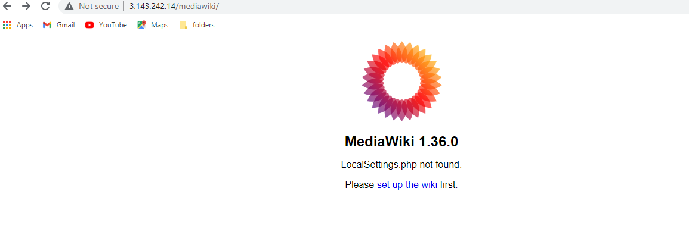
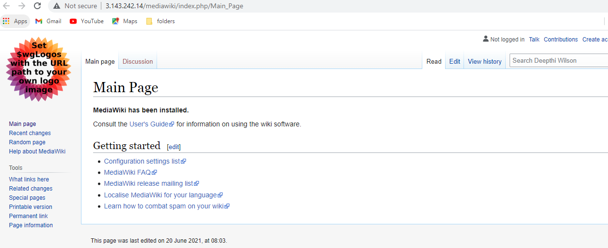

# MediaWiki Installation with Terraform and Ansible

Pre-Requisites for Running Terraform:
-------------------------------------
- Terraform Stack runs on an EC2 instance (referred as Control Machine) that has IAM Instance Profile role which has privileges to spin up the required EC2 components
- The Control Machine should have terraform, ansible and related pkgs installed already. 
- If running on other VM, AWS access key and secret keys are to be provided
- Public VPC , Subnet and EC2 KeyPair is expected to be already in place in the AWS account. EC2 key pair is uploaded in S3 for subsequent download on ansible stack

What Each Stack deploys:
------------------------
- Terraform
 	- Security Group with ingress and egress rules for the MediaWiki instance
    - An Ec2 instance for MediaWiki 

- Ansible
 	- Fetches the details of the terraform created Ec2 instance through tags and configures  Apache, PHP and MySQL for the MediaWiki instance
    - Creates MySQL Database and user
    - Installs 3rd party repo for Apache dependent packages
    - Configures the MediaWiki webserver

Steps to Run
-------------

1. Clone the Repository git clone https://github.com/deepthi-wilson/mediawiki.git

2. cd terraform-stack

3. Initialize the terraform with 
    -  terraform init

4. Create the terraform plan
    -  terraform plan -var-file=config.tfvars
5. Apply the terraform plan
    -  terraform apply -var-file=config.tfvars tfplan -auto-approve
6. Setting up of Config with Ansible
    - cd ../ansible-play
7. Run Ansible Playbook
    - ansible-playbook main.yml -vv 
8. Open the Browser and complete the installation.
    - Get the setup url tip: can be obtained from last output of ansible playbook run.

You Should be seeing as Below
-----------------------------

- Post run above stacks - Launch Wizard for SetUp completion

- Done!
